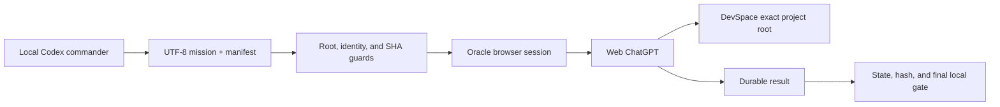

# Architecture

Codex Web GPT Automation is a guarded bridge between local Codex work and
signed-in web ChatGPT sessions. It does not replace Codex, Oracle, DevSpace, or
ChatGPT; it binds their identities and lifecycle into a recoverable workflow.

## Current execution path



| Layer | Owns | Must not own |
|---|---|---|
| Local Codex | scope, authorization, mission bytes, deterministic final checks | hidden web execution or guessed recovery |
| Dispatcher/state | exact root, model/effort, locks, hashes, lifecycle authority | semantic rewriting of completed web work |
| Oracle | signed-in browser session, model selection evidence, wait/harvest | project filesystem access outside DevSpace |
| Web ChatGPT | planning, research, implementation, review by selected mode | host credentials or unapproved roots |
| DevSpace | approved workspace tools and OAuth boundary | ChatGPT app registration automation |

## Guarded submission

Before a new project sends its first DevSpace-backed question, the normalized
project root must exactly match one current `allowedRoots` entry. Parent,
child, same-name, or other-drive paths are not substitutes. The qualification
is cached against the DevSpace config hash and repeated only when configuration
changes.

Every run records the project, mission bytes, transport, model, Power, operation
authority, and artifact identity. Power 1-5 is orthogonal to authority, so
Power 5 can perform an authorized edit/orchestrator mission just like lower
Power levels.

DevSpace remains preferred. The one-shot dispatcher may use same-Power
attachment transport only after a structured deterministic pre-submit
DevSpace failure and byte-for-byte unchanged-workspace proof. A one-shot
authority receipt is consumed before fallback launch and binds the exact run,
root, Power, mission, and attachment hashes. Write fallback returns a strict
patch that the host validates and applies transactionally.

Patch apply and WAL recovery are serialized under the exact-project mutex,
recheck parent paths before each mutation, and reject any symlink or reparse
point in a proof snapshot. This is a guarded automation boundary for ordinary
local concurrency, not an OS sandbox against a malicious same-account process
that can forge journals or race Windows path operations.

Fallback acceptance is power-loss ordered: every missing episode and sealed
transaction ancestor is created one level at a time and each new entry's
parent is durably synchronized before JSON persistence proceeds. JSON uses a
flushed and file-synced temporary, atomic replacement, and parent durability
before finalize. Oracle run directories use the same ancestor protocol;
mission/fallback instruction bytes are durable before submission, and closed
stdout, stderr, harvested output, and the generated transcript are flushed
before their hashes or receipts enter terminal state and dispatcher
acceptance. POSIX requires file and parent-directory `fsync`. Windows uses
`MoveFileExW(MOVEFILE_WRITE_THROUGH)` plus destination `FlushFileBuffers`; if
Windows refuses a flushable directory handle, the acceptance evidence records
that exact limitation and its reliance on write-through rather than claiming a
portable directory `fsync` occurred.

The one-shot dispatcher also persists an immutable execution authority,
normalized contract, whole-workspace baseline, deterministic run id, and phase
journal before the primary submission. A crash or timeout therefore resumes
the same exact session and then only the local diff/gate or patch phase; it
cannot create a replacement prompt.

## Recoverable lifecycle

The project lock follows exact session authority:

```text
pre-submit -> submitted/unknown -> live -> terminal -> harvested
```

Authority is monotonic. A post-submit timeout never creates a replacement run;
recovery uses the persisted Oracle slug and conversation URL. Once submission
or mutation is possible, attachment fallback is forbidden. A proven pre-submit
failure can be settled only through its supported evidence path.

## Staged workflows

- `orchestrator` is one authorized web implementation pass.
- comprehensive mode binds plan, review, implementation, and gates with
  per-stage identity and hash receipts.
- Web Multi-GPT runs genuinely independent Oracle sessions in bounded waves and
  merges compact handoffs.
- Local Multi-GPT is an optional read-only PC-local advisory tool.
- Ultra Economy Mode constrains local command to Luna Max and separates Pro
  design, web implementation, and web verification.

## Installation lifecycle

The portable installer owns only files listed by `install-manifest.json`.
Before mutation it creates backups, a write-ahead log, and a receipt. Rollback
and uninstall are exact inverses for unchanged managed bytes; modified or
unmanaged destinations are preserved as conflicts.

## Compatibility boundary

`codexpro-*` and agbrowse assets are frozen identifiers for exact recovery of
persisted legacy work. New work uses Oracle. See [Frozen Legacy](FROZEN_LEGACY.md)
for the inventory and the versioned architecture files for historical details.
